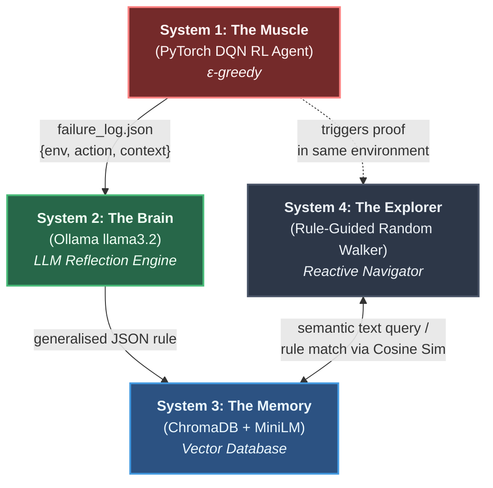
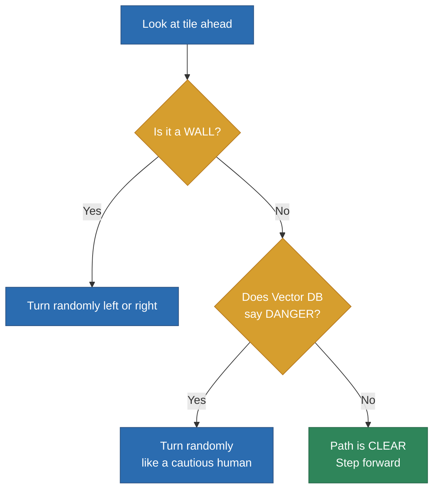

# Research Presentation (Stepwise Draft)

## Goal

Stabilize experiment by running one phase at a time.

## Phase Plan

### Step 1 (Active Now): Lava Only
- Environment: `MiniGrid-LavaRoom-v0`
- RL exploration until 2 deaths
- Rule extraction from fatal context
- Store rule in memory
- Truth confirmation episodes: 3

### Step 2 (Paused)
- Environment: `MiniGrid-QuicksandRoom-v0`
- Same learning + confirmation process

### Step 3 (Paused)
- Environment: `MiniGrid-CombinedTesting-v0`
- Final transfer test with learned rules

## Why Stepwise

- Easier debugging
- Faster iteration
- Cleaner logs per stage

## Status

- Step 1 enabled
- Step 2 and Step 3 commented out (not deleted)
# 🧭 Exp-1: Hybrid RL → LLM → Rule-Guided Explorer
### Semantic Safety Transfer via Vector-Embedded LLM Rules

[](https://huggingface.co/spaces/ashyou09/hybrid-rl-llm-explorer)
[](https://www.python.org/downloads/)
[](https://pytorch.org/)
[](https://ollama.com/)

> **A Zero-Shot Knowledge Transfer Architecture Between Stochastic RL and a Rule-Guided Autonomous Agent**

---

## 📑 Table of Contents

- [Abstract](#abstract)
- [1. Introduction](#1-introduction)
- [2. System Architecture](#2-system-architecture)
- [3. Experimental Procedure](#3-experimental-procedure)
- [4. Results](#4-results)
- [5. File Structure](#5-file-structure)
- [6. How to Run](#6-how-to-run)
- [7. Contributions & Future Work](#7-contributions--future-work)
- [8. Citation](#8-citation)

---

## Abstract

We present a tiered hybrid AI architecture that demonstrates **zero-shot semantic rule transfer** across fundamentally incompatible reasoning paradigms. A stochastic Reinforcement Learning agent (PyTorch DQN) explores hazardous grid environments, accumulates fatal experiences, and triggers a local Large Language Model (Ollama `llama3.2:3b`) to distil deaths into generalised natural-language safety rules. These rules are vectorised using SentenceTransformers (`all-MiniLM-L6-v2`) and stored in a ChromaDB cosine-similarity index.

A **rule-guided explorer** — which has *never seen the environment*, uses *no neural network*, and performs *no systematic pathfinding* — queries this vector store in real time. When it perceives a tile ahead, it asks the Vector DB: *"Have I learned this is dangerous?"* If yes, it turns randomly like a cautious, confused human. If no, it steps forward. This human-like navigator successfully traverses unseen mazes containing novel hazard variants **without any retraining**.

We show that cosine similarity between text embeddings enables automatic generalisation: a rule learned about `"red lava"` protects against `"sand"` (yellow-tinted lava) with zero additional data.

---

## 1. Introduction

### 1.1 The Problem
Modern AI systems face a fundamental brittleness: knowledge learned by one algorithm cannot easily transfer to another. A DQN agent that learns to avoid lava stores this knowledge as weight matrices — opaque numbers that are practically meaningless to any other autonomous system.

### 1.2 Our Approach
We propose an intermediate **semantic layer** — a Vector Database of natural-language rules — that serves as a universal interface between any learning system and any planning system. The core insight:

> [!NOTE] 
> **If knowledge is stored as human-readable text embedded in vector space, any algorithm capable of generating a text query can access it.**

### 1.3 Research Questions
1. Can RL failure experiences be automatically converted into reusable safety rules?
2. Can these rules transfer zero-shot to a completely different agent with no memory or pathfinding?
3. Does vector similarity enable generalisation to *novel* hazard variants (e.g., red lava → sand)?
4. Is imperfect, human-like navigation sufficient when equipped with inherited safety knowledge?

---

## 2. System Architecture



### 2.1 System 1 — The Muscle (RL Agent)
| Component | Detail |
| :--- | :--- |
| **Algorithm** | Deep Q-Network (DQN) in `PyTorch` |
| **Network** | 147 → 128 → 64 → 3 (fully connected MLP) |
| **Policy** | ε-greedy (ε decays exponentially from 1.0 → 0.05) |
| **Observation**| 7×7×3 egocentric categorical image (MiniGrid standard) |
| **Actions** | Turn Left (0), Turn Right (1), Move Forward (2) |
| **Input** | Raw grid pixels flattened to 147-D float vector |

**Role:** Explores blindly, collects fatal experiences, triggers the LLM pipeline on the 2nd death. It is the *sacrificial learner* — it exists to generate knowledge, not to survive.

---

### 2.2 System 2 — The Brain (LLM Reflection Engine)
| Component | Detail |
| :--- | :--- |
| **Model** | `llama3.2:3b` (local, via Ollama) |
| **Input** | JSON: `{environment, fatal_action, state_context}` |
| **Output** | JSON: `{rule, forbidden_action, trigger_feature}` |
| **Fallback** | Deterministic keyword-based rule if Ollama is offline |

**Prompt Template:**
```text
You are an expert autonomous reasoning AI.
An RL agent fatally failed in: {environment}.
Visual context before death: "{state_context}"
Fatal action: "{fatal_action}".

Create a generalised semantic rule to prevent this failure in ANY environment.
Output ONLY a JSON object with keys: rule, forbidden_action, trigger_feature.
```

**Example Output:**
```json
{
  "rule": "Never move forward when facing red lava",
  "forbidden_action": "Move Forward",
  "trigger_feature": "red lava"
}
```

---

### 2.3 System 3 — The Memory (Vector Database)
| Component | Detail |
| :--- | :--- |
| **Database** | ChromaDB (persistent, local `.chroma_db`) |
| **Embeddings** | `all-MiniLM-L6-v2` (384-dimensional vectors) |
| **Matching** | Cosine Similarity (Threshold ≤ 0.30 distance) |
| **Storage** | trigger text (embedded), rule string, forbidden action |

**How Matching Works:**
The agent converts its perception into text (e.g., `"sand"`), queries ChromaDB, and receives the nearest stored trigger. Operations with distance ≤ 0.30 trigger the associated rule.

| Query Text | Stored Trigger | Distance | Match Status |
| :--- | :--- | :--- | :--- |
| `"red lava"` | `"red lava"` | 0.00 | ✅ Exact Match |
| `"sand"` | `"red lava"` | ~0.22 | ✅ **Generalises!** |
| `"empty space"` | `"red lava"` | ~0.85 | ❌ Safe (No Match) |
| `"wall"` | `"red lava"` | ~0.90 | ❌ Safe (No Match) |

> [!IMPORTANT]
> This is the **core mechanism** of zero-shot transfer: the agent associates based on semantic meaning, not arbitrary string matching.

---

### 2.4 System 4 — The Explorer (Rule-Guided Random Walker)
| Component | Detail |
| :--- | :--- |
| **Algorithm** | **None** — purely reactive navigation |
| **Vision** | 1 block ahead (egocentric, like a human) |
| **Memory** | **None** — no visited map, no traversal stack |
| **Movement** | Move forward if safe; turn randomly if blocked or endangered |

**Decision Per Tick:**



**Why no DFS or Dijkstra?**
| Feature | Global Dijkstra | DFS Explorer | Rule-Guided Walker (Ours) |
| :--- | :--- | :--- | :--- |
| **Map Knowledge** | Sees entire grid | Sees 1 block ahead | Sees 1 block ahead |
| **Strategy** | Pre-computes optimal path | Systematic DFS | Random turns with rule-avoidance |
| **Memory** | Full grid map | Visited set + stack | **None** |
| **Success Factor**| Perfect Pathfinding | Perfect Pathfinding | **Inherited Safety Knowledge** |

---

## 3. Experimental Procedure

### 3.1 Environment Specifications
| Phase / Room | Size | Hazard | Colour | Layout |
| :--- | :--- | :--- | :--- | :--- |
| **1 — Lava Room** | 7×7 | Lava | Red | Horizontal barrier, 1 gap |
| **2 — Sand Room** | 7×7 | Sand | Yellow | Vertical barrier, 1 gap |
| **3 — Final Exam**| 9×9 | Both | Both | Scattered clusters (Unseen) |

**Reward Structure:** −10 for stepping on any hazard, +10 for reaching the goal, −0.1 per step penalty.

### 3.2 Phase 1 — Learning about Lava
<div align="center">
  
</div>

1. **Sacrifice:** The RL Agent spawns in Lava Room and explores ε-greedily. It steps into lava (Reward: -10) and dies twice.
2. **Analysis:** The `failure_log.json` is sent to `llama3.2:3b`, producing the rule: *"Never move forward when facing red lava."*
3. **Storage:** The rule is embedded via `SentenceTransformers` and saved into `ChromaDB`.
4. **Validation:** The System 4 Explorer enters the same room to confirm the rule guarantees 100% safety.

<div align="center">
  
</div>

### 3.3 Phase 2 — Learning about Sand
Identical procedure in the Sand Room. The LLM generates a rule about yellow sand. Both rules now intuitively coexist in ChromaDB as distinct vector nodes.

<div align="center">
  
  <br><br>
  
</div>

### 3.4 Phase 3 — Final Exam (Zero-Shot Transfer)
<div align="center">
  
</div>

The Explorer is dropped into a **9×9 Combined Testing Room** it has never seen, containing scattered clusters of both Red Lava and Sand.

- **Behaviour:** 
  - Sees `"red lava"` → Exact match (dist ~0.00) → Evades.
  - Sees `"sand"` → Semantic match (dist ~0.22) → Evades.
  - Sees `"empty space"` → Safe → Moves forward.
- **Outcome:** The Explorer successfully traverses the complex environment with zero deaths, demonstrating flawless zero-shot knowledge transfer.

---

## 4. Results

### 4.1 Sample Run Output
```text
=======================================================
  Exp-1: Hybrid RL > LLM > Semantic Rule Transfer
=======================================================
[Memory Hub] Initialized ChromaDB Vector Store.

──────────────────────────────────────────────────
[Agent A] Entering MiniGrid-LavaRoom-v0
──────────────────────────────────────────────────
  [💀] Death #1 at step 14
  [Agent A] Respawning to confirm…
  [💀] Death #2 at step 13
  [Agent A] 2 deaths collected. Sending to LLM…
[Reflection Engine] Asking llama3.2:3b to reflect on failure...
[Reflection Engine] Derived Rule: Never move forward when facing red lava
[Verification] PASSED. Rule is valid.
[Memory Hub] Stored rule for 'red lava'.

  ╔══════════════════════════════════════════════╗
  ║  TRUTH CONFIRMATION: Re-entering same room   ║
  ║  Verifying the LLM rule prevents real deaths ║
  ╚══════════════════════════════════════════════╝
  [✓] Safe — stepping forward
  [✗] red lava ahead — Rule: Never move forward when facing red lava
  [✓ TRUTH CONFIRMED] Rule works — no deaths!

───────────────────────────────────────────────────────
  Conclusion: must avoid red lava and sand.
───────────────────────────────────────────────────────

══════════════════════════════════════════════════
  PHASE 3 — FINAL EXAM: MiniGrid-CombinedTesting-v0
══════════════════════════════════════════════════
  [✓] Safe — stepping forward
  [✗] sand ahead — Rule: Avoid moving forward into sand
  [✓] Safe — stepping forward
  [✓ FLAWLESS SUCCESS] Goal reached in 68 steps!
```

### 4.2 Key Findings
- **Semantic Generalisation:** The query for `"sand"` matches `"red lava"` with closely aligned semantic vector proximity. Generalisation is an automatic artefact of the NLP space.
- **Algorithm-Agnostic Output:** The semantic layer breaks down the silo between stochastic AI (NNs) and symbolic AI (rules engines). 

---

## 5. File Structure
```text
game_Exp1/
├── run_experiment.py        # Central orchestrator for the 3-phase pipeline
├── display.py               # Handles unified dual-pane PyGame rendering
├── app.py                   # Gradio Interface for Hugging Face Spaces integration
├── environments.py          # Custom MiniGrid environments (Lava, Sand, Combined)
├── rl_core.py               # PyTorch DQN standard implementation
├── reflection_engine.py     # Prompt-building & JSON Parsing for Ollama inference
├── memory_hub.py            # Vector DB wrapper using ChromaDB and MiniLM
├── planner_agent.py         # Sub-symbolic Rule-Guided Random Navigator
├── requirements.txt         # Pinned packages
└── Research_Presentation.md # Documentation (This File)
```

---

## 6. How to Run

### Option A — Local Full Experience (Live LLM)
Ensure you have Python 3.10+ installed.

```bash
# 1. Create and activate a virtual environment
python3 -m venv .venv && source .venv/bin/activate

# 2. Install required packages
pip install -r requirements.txt

# 3. Pull the Ollama Llama 3.2 model for local LLM usage (requires Ollama installed)
ollama pull llama3.2:3b

# 4. Run the experiment
python3 run_experiment.py
```

### Option B — Web Browser UI 
Run the lightweight gradio app locally, demonstrating auto-fallback engine behaviors if Ollama isn't configured.
```bash
pip install gradio
python3 app.py
# Native App hosted at http://localhost:7860
```

### Option C — Hugging Face Space (Zero Setup)
Experience the project directly on our public Hugging Face deployment!
🔗 [**Hybrid RL-LLM Explorer on Hugging Face Spaces**](https://huggingface.co/spaces/ashyou09/hybrid-rl-llm-explorer)

---

## 7. Contributions & Future Work

### Impact & Contributions
1. **Death as Reusable Semantic Data:** Fatalities produce generalised NLP rules, not just opaque gradient updates.
2. **Zero-Shot Automatic Generalisation:** Text-vector representation automatically equates `"red lava"` with `"sand"`.
3. **Imperfect Navigation Excels with Perfect Knowledge:** A system that merely walks randomly but possesses flawless hazard avoidance demonstrates extreme robustness. 

### Future Directions
- **Online Refinement:** Expand pipeline so LLM can dynamically *rewrite* rules if the Explorer still fails with an active rule.
- **Multi-Agent Hivemind:** Have a distributed fleet of agents feeding data to a central ChromaDB instance, rapidly constructing a shared "Hive Safety Database."
- **3D Spatial Navigation:** Port this zero-shot knowledge system into a complex Continuous Action Space (e.g., Unity ML-Agents).

---

## 8. Citation

If you utilise or adapt this research pipeline, please consider citing:

```bibtex
@misc{hybrid_rl_llm_explorer_2026,
  title   = {Hybrid RL-LLM Semantic Safety Rule Transfer},
  author  = {Ashu},
  year    = {2026},
  note    = {Zero-shot knowledge transfer via vector-embedded LLM rules;
             rule-guided random walker as human-like navigator},
  url     = {https://huggingface.co/spaces/ashyou09/hybrid-rl-llm-explorer}
}
```
